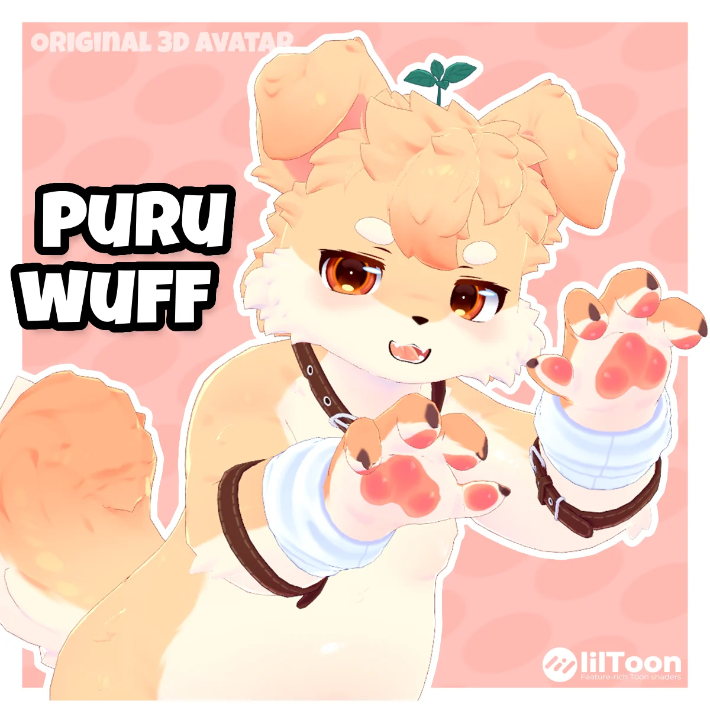

# Puruwuff - 3D Furry Avatar 公式ポータル

ひと口食べればぷくぷく？シャツめくりとプリン食べさせに対応したプリン犬系ケモノモデル🍮

[English](README.md) | **日本語** | [简体中文](README.zh-CN.md)

- 展示画像をすべて見る：[展示（9 枚）](gallery/gallery.md)
- VRChat 試着：[VRChat で開く](https://vrchat.com/home/avatar/avtr_b0d2d0fa-bc3c-4957-bb4e-5a026e4db63a)
- VRM モデル展示（full_outfit）：[Puruwuff Full_Outfit — VRoid Hub](https://hub.vroid.com/en/characters/1221089435497151749/models/5018229049494589851)
- VRM モデル展示（chubby）：[Puruwuff Chuby — VRoid Hub](https://hub.vroid.com/en/characters/1221089435497151749/models/5606967958032443628)

## 販売ショップ

| プラットフォーム | 商品ページ |
| --- | --- |
| gumroad | [takkoowo.gumroad.com/l/Puruwuff](https://takkoowo.gumroad.com/l/Puruwuff) |
| jinxxy | [jinxxy.com/Takko/puruwuff](https://jinxxy.com/Takko/puruwuff) |
| booth.pm | [takkoowo.booth.pm/items/8847318](https://takkoowo.booth.pm/items/8847318) |
| bilibili工房 | _未定_ |

<!-- TODO: bilibili工房 の商品ページ URL は未公開。決まり次第ここに追記 -->

## 機能・ギミック

- ジェスチャーで発動する表情が 12 個、メニュー表情が 6 個
- 衣装パーツは個別にオン・オフ制御でき、シャツはめくることができ、リード（綱）も引けます
- 体型は調整可能で、足の指・しっぽ・耳にアニメーションが付いています
- プリンを食べさせることができ、少しずつ太っていきます
- 詳細：[VRCモデルの遊び方](vrc-features/vrc-features.ja.md)

## モデル仕様

| 項目 | 内容 |
| --- | --- |
| ポリゴン数 | 身体 40772 ／ 衣装 19852 ／ プリン小道具 1376 |
| シェイプキー | ARKit 52 ／ Viseme 15 ／ MMD 45 ／ 追加カスタム表情 20+ ／ clothing fit シェイプキー若干 ／ 体型 chubby シェイプキー |
| マテリアル | 3 |
| パフォーマンスランク | Poor |

## 同梱物

- VRChat UnityPackage プロジェクトファイル
- VRM UnityPackage プロジェクトファイル
- FBX
- Blender プロジェクトファイル
- Substance Painter プロジェクトファイル
- PSD ファイル

## 導入方法・必要アセット

- VRChat プロジェクトは Modular Avatar と lilToon shader に依存しています。
- プロジェクトに含まれる素体・衣装（outfit）・プリン小道具の MA コンポーネントを使い、組み合わせて別バージョンとしてアップロードできます。
- GogoLoco や VRCFT などのコンポーネントはご自身で追加できます。
- 詳細：[インポートガイド](install/install.ja.md)

## 利用規約

- ✅ 簡単に言うと：個人ユーザー・クリエイターとして、収益化を伴う配信、同人創作での収益化、制作したアクセサリの販売が可能で、許諾の問い合わせは不要です。
- ❌ プロジェクトファイルの内容を外部へ漏らしたり転売したりしないでください。
- 詳細：[ライセンス全文](license/license.ja.md)

## 更新履歴

- 現在のバージョン：1.0.0（2026-10-07 更新）
- 詳細：[更新履歴の全文](changelog/changelog.ja.md)

## お問い合わせ

- ご購入後にご不明な点があれば、X にてご連絡ください。
  - <https://x.com/Takko_233>

## Credits

SFX: @OpenNSFWSP
